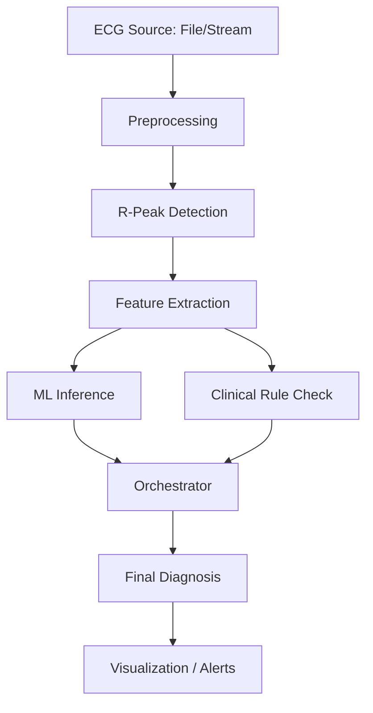

# Arrythmia AI Workstation: Architectural Overview

This document provides a technical deep-dive into the architecture, data flow, and core logic of the ECG Arrhythmia AI Workstation.

## 🏗️ System Architecture

The project is structured as a modular AI-driven diagnostic system, combining real-time signal processing, Deep Learning (Transformer-based), and a Clinical Rule Engine.

### Core Components

1.  **Signal Processing Layer (`signal_processing/`)**:
    *   **Cleaning**: Baseline wander removal and powerline interference filtering.
    *   **Beat Detection**: Robust R-peak detection using NeuroKit2.
    *   **Feature Extraction**: Calculation of HRV (Heart Rate Variability), morphology, and clinical intervals (PR, QRS duration).

2.  **Decision Engine (`decision_engine/`)**:
    *   **ML Classifier**: A Transformer-based model optimized for 31+ arrhythmia classes.
    *   **Rule Engine**: A layer of clinical logic that validates ML predictions against standard ECG criteria (e.g., HR limits, QRS width).
    *   **Orchestrator**: Harmonizes ML and Rules, handles "veto" logic (e.g., cardiologist vs. AI), and manages pattern recognition (Runs, Bigeminy, etc.).

3.  **gRPC Streaming Server (`grpc_server.py`)**:
    *   Enables real-time bi-directional streaming for medical devices.
    *   Buffers incoming high-frequency ECG samples until a full segment (10s) is ready for processing.
    *   Streams back `ArrhythmiaAlert` messages instantly.

4.  **Web Dashboard (`dashboard/`)**:
    *   Flask-based GUI for data visualization.
    *   Interactive ECG plotting with D3.js or similar.
    *   Manual annotation tools for cardiologists to verify AI findings.

5.  **Explainable AI (`xai/`)**:
    *   Provides clinical justifications for every detection.
    *   Generates "Saliency Maps" to show which part of the waveform triggered the AI response.

## 🔄 Data Pipeline

### 1. Ingestion
Data is received either as JSON uploads (Web Dashboard) or as a live stream via gRPC.

### 2. Processing (10s Segments)
All analysis happens on 10-second segments. This duration is clinically standard for detecting episodic arrhythmias like PACs or PVCs.

### 3. The "Decide" Phase
The `RhythmOrchestrator` performs the following steps:
1.  **SQI (Signal Quality Index)**: Checks if the signal is too noisy. If so, it flags it as UNRELIABLE.
2.  **Background Rhythm**: Identifies the primary rhythm (e.g., Sinus Bradycardia).
3.  **Specific Events**: Looks for ectopic beats (PVC, PAC) and rhythm changes (AFib, SVT).
4.  **Pattern Recognition**: Groups individual PVCs into patterns like Couplets, Runs, or Bigeminy.
5.  **Display Arbitration**: Decides which alerts are most important. For example, if both AFib and a PAC are detected, AFib takes priority.

## 🛠️ Specialized Logic

### Ectopy Pattern Rules
- **Couplet**: 2 consecutive ectopic beats.
- **Run**: exactly 3 consecutive ectopic beats.
- **NSVT/PSVT**: 4 or more consecutive beats at a rate >= 100 BPM.
- **Bigeminy**: Every other beat is ectopic.

### Veto System
The system is designed to "Pair Program" with doctors. If a cardiologist manually marks a segment as "Sinus Rhythm", the AI's rhythm predictions are suppressed while maintaining the clinical features calculation.

## 📊 Database Schema
The system uses PostgreSQL for persistence, storing:
- **Raw Segments**: JSONB storage of processed signal data.
- **Features**: Pre-calculated clinical metrics.
- **Annotations**: Dual-layered (AI-generated + Cardiologist-verified).
